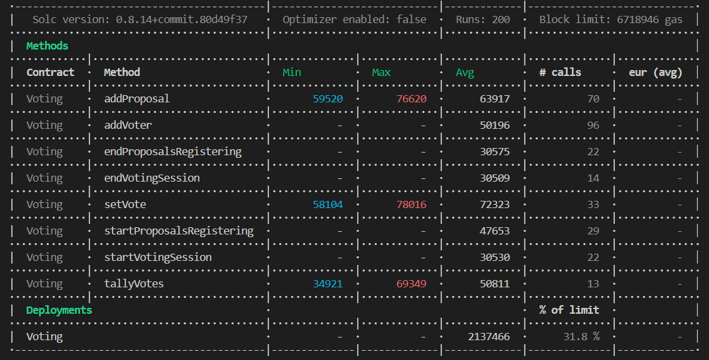

 

<h1 align="center">Unit test for Voting.sol</h3>
  

    This project contains all of my unit tests for Voting.sol.
  

<!-- TABLE OF CONTENTS -->

  
Table of Contents

  <ol>
    <li><a href="#about-the-project">About The Project</a></li>
    <li><a href="#test-workflow-change-functions">Test workflow change functions</a></li>
    <li><a href="#test-addvoter-and-getvoter-functions">Test addVoter and getVoter functions</a></li>
    <li><a href="#test-addproposal-and-getoneproposal-functions">Test addProposal and getOneProposal functions</a></li>
    <li><a href="#test-setvote-function">Test setVote function</a></li>
    <li><a href="#test-tallyvotes-function">Test tallyVotes function</a></li>
    <li><a href="#testing-interaction-functions-from-every-workflow-statuses">Testing interaction functions from every workflow statuses</a></li>
    <li><a href="#gas-report">Gas report</a></li>

  </ol>

<!-- ABOUT THE PROJECT -->
## About The Project

This project has been done as part of my blockchain developper training at Alyra, to teach us how to write unit tests for the voting project.  
I chose to first test the functions that perform a workflow status change.  
Then I tested all of the interaction functions with the voting system (adding proposals, adding votes...).
And in the end I tested each of the interaction functions in all possible workflow statuses to make sure that they work well in the desired status and not another.

(<a href="#top">back to top</a>)

## Number total of tests : 88

<!-- Test workflow -->
## Test workflow change functions
### 35 tests

I started by testing functions that the change the workflow because these functions are for me the most important to guarantee the strict orders of the vote.  
I test that these functions correctly change the workflow status but also that they cannot be called from a status that does not correspond to them. I also took advantage of this part to test the onlyOwner modifier on these functions.

So I tested the following functions:
<ul>
    <li>startProposalsRegistering()</li>
    <li>endProposalsRegistering()</li>
    <li>startVotingSession()</li>
    <li>endVotingSession()</li>
    <li>tallyVotes()</li>
</ul>

### Result of workflow status change tests
    test workflow change functions...
      check onlyOwner
        ✔ should not change workflow to ProposalsRegistrationStarted if not the owner, revert
        ✔ should not change workflow to ProposalsRegistrationEnded if not the owner, revert
        ✔ should not change workflow to VotingSessionStarted if not the owner, revert
        ✔ should not change workflow to VotingSessionEnded if not the owner, revert
        ✔ should not change workflow to VotesTallied if not the owner, revert
      from RegisteringVoters WorkflowStatus
        ✔ should not change workflow to ProposalsRegistrationEnded, revert
        ✔ should not change workflow to VotingSessionStarted, revert
        ✔ should not change workflow to VotingSessionEnded, revert
        ✔ should not change workflow to VotesTallied, revert
        ✔ should change workflow to ProposalsRegistrationStarted, get event WorkflowStatusChange
      from ProposalsRegistrationStarted WorkflowStatus
        ✔ should not change workflow to ProposalsRegistrationStarted, revert
        ✔ should not change workflow to VotingSessionStarted, revert
        ✔ should not change workflow to VotingSessionEnded, revert
        ✔ should not change workflow to VotesTallied, revert
        ✔ should change workflow to ProposalsRegistrationEnded, get event WorkflowStatusChange
      from ProposalsRegistrationEnded WorkflowStatus
        ✔ should not change workflow to ProposalsRegistrationStarted, revert
        ✔ should not change workflow to ProposalsRegistrationEnded, revert
        ✔ should not change workflow to VotingSessionEnded, revert
        ✔ should not change workflow to VotesTallied, revert
        ✔ should change workflow to VotingSessionStarted, get event WorkflowStatusChange
      from VotingSessionStarted WorkflowStatus
        ✔ should not change workflow to ProposalsRegistrationStarted, revert
        ✔ should not change workflow to ProposalsRegistrationEnded, revert
        ✔ should not change workflow to VotingSessionStarted, revert
        ✔ should not change workflow to VotesTallied, revert
        ✔ should change workflow to VotingSessionEnded, get event WorkflowStatusChange
      from VotingSessionEnded WorkflowStatus
        ✔ should not change workflow to ProposalsRegistrationStarted, revert
        ✔ should not change workflow to ProposalsRegistrationEnded, revert
        ✔ should not change workflow to VotingSessionStarted, revert
        ✔ should not change workflow to VotingSessionEnded, revert
        ✔ should change workflow to VotesTallied, get event WorkflowStatusChange
      from VotesTallied WorkflowStatus
        ✔ should not change workflow to ProposalsRegistrationStarted, revert
        ✔ should not change workflow to ProposalsRegistrationEnded, revert
        ✔ should not change workflow to VotingSessionStarted, revert
        ✔ should not change workflow to VotingSessionEnded, revert
        ✔ should not change workflow to VotesTallied, revert

(<a href="#top">back to top</a>)

<!-- Test addVoter and getVoter -->
## Test addVoter and getVoter functions
### 8 tests

Then I move on to functions that interact directly with the voting system.
I start with addVoter and getVoter.  
I first test that these functions fail under different conditions (onlyOwner, already registered voter...). Then I make sure that these functions have the desired behavior.

### Result of addVoter and getVoter tests :
    test addVoter and getVoter
      test on failure
        ✔ should not register if not the owner, revert
        ✔ should not getVoter from non registered voter, revert
        ✔ should not register an already registered voter, revert
      test on success
        ✔ should register a new voter, get isRegistered
        ✔ should register a new voter, get hasVoted
        ✔ should register a new voter, get votedProposalId
        ✔ should register a new voter, get event VoterRegistered
        ✔ should register 5 new voters, get isRegistered of third

(<a href="#top">back to top</a>)

<!-- Test addProposal and getOneProposal -->
## Test addProposal and getOneProposal functions
### 7 tests

Next with addProposal and getOneProposal.  
We start to check the behavior on failures then on successes.

### Result of addProposal and getOneProposal tests :
    test addProposal and getOneProposal
      test on failure
        ✔ should not add proposal if not registered voter, revert
        ✔ should not add an empty proposal, revert
        ✔ should not get proposal if not registered voter, revert
      test on success
        ✔ should add proposal, get description
        ✔ should add proposal, get voteCount
        ✔ should add proposal, get event ProposalRegistered
        ✔ should add 5 proposals, get description of third

(<a href="#top">back to top</a>)

<!-- Test setVote -->
## Test setVote function
### 8 tests

With setVote we use both functions getVoter and getOneProposal to make sure of the behavior.

### Result of setVote tests :
    test setVote
      test on failure
        ✔ should not set vote if not registered voter, revert
        ✔ should not set vote if already voted, revert
        ✔ should not set vote for a non existing proposal
      test on success
        ✔ should set vote, get votedProposalId
        ✔ should set vote, get hasVoted
        ✔ should set vote, get voteCount
        ✔ should set vote, get event Voted
        ✔ should set 5 votes, get voteCount of third proposal

(<a href="#top">back to top</a>)

<!-- Test tallyVotes -->
## Test tallyVotes function
### 2 tests

For tallyVotes we use the default getter of winningProposalID to check the result.  

### Result of tallyVotes tests :
    test tallyVotes and get winningProposalID
      test on failure
        ✔ should not tally votes if not the owner, revert
      test on success
        ✔ should tally votes, get winningProposalID

(<a href="#top">back to top</a>)

<!-- Test interaction functions workflow -->
## Testing interaction functions from every workflow statuses
### 28 tests
Finally I test all the interaction functions that depend on the workflow status in each workflow status. This allows me to make sure that these functions cannot be called from another status than the one desired.

### Result of testing interaction functions from every workflow statuses :
    test functions depending on workflows...
      from RegisteringVoters WorkflowStatus
        ✔ should register 5 voters
        ✔ should not add proposal, revert
        ✔ should not set vote, revert
        ✔ should not tally votes, revert
        ✔ should change workflow to ProposalsRegistrationStarted, get event WorkflowStatusChange
      from ProposalsRegistrationStarted WorkflowStatus
        ✔ should not register voter, revert
        ✔ should add 5 proposals
        ✔ should not set vote, revert
        ✔ should not tally votes, revert
        ✔ should change workflow to ProposalsRegistrationEnded, get event WorkflowStatusChange
      from ProposalsRegistrationEnded WorkflowStatus
        ✔ should not register voter, revert
        ✔ should not add proposal, revert
        ✔ should not set vote, revert
        ✔ should not tally votes, revert
        ✔ should change workflow to VotingSessionStarted, get event WorkflowStatusChange
      from VotingSessionStarted WorkflowStatus
        ✔ should not register voter, revert
        ✔ should not add proposal, revert
        ✔ should set 5 votes, revert
        ✔ should not tally votes, revert
        ✔ should change workflow to VotingSessionEnded, get event WorkflowStatusChange
      from VotingSessionEnded WorkflowStatus
        ✔ should not register voter, revert
        ✔ should not add proposal, revert
        ✔ should not set vote, revert
        ✔ should tally votes and change workflow to VotesTallied, get event WorkflowStatusChange
      from VotesTallied WorkflowStatus
        ✔ should not register voter, revert
        ✔ should not add proposal, revert
        ✔ should not set vote, revert
        ✔ should not tally votes, revert

(<a href="#top">back to top</a>)

<!-- Gas Report -->
## Gas Report

  

(<a href="#top">back to top</a>)
